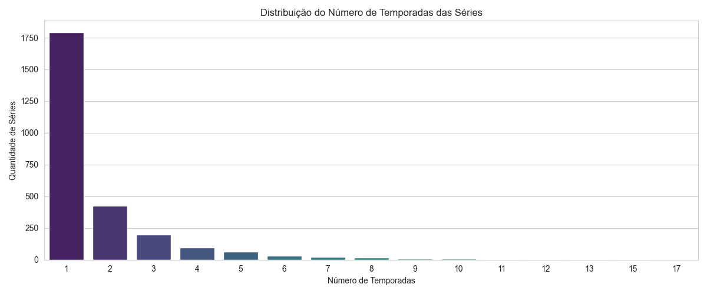

# Análise Exploratória de Dados do Catálogo da Netflix

## 📖 Sobre o Projeto

Este projeto consiste em uma **Análise Exploratória de Dados (EDA)** do famoso dataset "Netflix Movies and TV Shows", disponível no Kaggle. O objetivo é praticar a manipulação e limpeza de dados, bem como a criação de visualizações para extrair insights e responder a perguntas sobre a composição do catálogo da plataforma.

Todo o processo foi desenvolvido em Python, utilizando principalmente as bibliotecas **Pandas** para a manipulação dos dados e **Matplotlib/Seaborn** para a visualização.

---

## 🛠️ Ferramentas Utilizadas

* **Linguagem:** Python 3
* **Bibliotecas:**
    * Pandas
    * Matplotlib
    * Seaborn
    * Jupyter Notebook (ou qualquer ambiente Python)

---

## 📊 Análises Realizadas e Insights

Neste projeto, busquei responder a diversas perguntas sobre o catálogo. Abaixo estão algumas das principais análises e suas conclusões:

#### 1. Filmes vs. Séries
* **Pergunta:** A Netflix tem mais filmes ou mais séries em seu catálogo?
* **Insight:** O catálogo é predominantemente composto por filmes, superando o número de séries por uma margem considerável.
    * *[Insira aqui a imagem do seu gráfico de barras de Filmes vs. Séries]*

#### 2. Top 10 Países Produtores de Conteúdo
* **Pergunta:** Quais países mais produzem conteúdo para a plataforma?
* **Insight:** Os Estados Unidos lideram com folga, seguidos por Índia e Reino Unido, demonstrando a diversidade e o alcance global do conteúdo.
    * 

#### 3. Evolução dos Lançamentos ao Longo dos Anos
* **Pergunta:** Como o volume de lançamentos de títulos presentes no catálogo evoluiu com o tempo?
* **Insight:** O gráfico de linhas mostra um crescimento exponencial a partir dos anos 2010, com um pico de produções lançadas em 2018.
    * *[Insira aqui a imagem do seu gráfico de linha dos lançamentos]*

#### 4. Gêneros Mais Comuns
* **Pergunta:** Quais são os gêneros mais populares na plataforma?
* **Insight:** "International Movies", "Dramas" e "Comedies" dominam o topo da lista, mostrando uma preferência clara por esses formatos.
    * 

#### 5. Distribuição da Duração dos Filmes
* **Pergunta:** Qual é a duração mais comum para os filmes?
* **Insight:** O histograma revela uma forte concentração de filmes com duração entre 90 e 120 minutos, o que parece ser um padrão na indústria.
    * 

#### 6. Distribuição do Número de Temporadas das Séries
* **Pergunta:** A maioria das séries são longas ou curtas?
* **Insight:** A esmagadora maioria das séries possui apenas 1 temporada, indicando uma alta rotatividade de conteúdo ou um foco em minisséries.
    * 

---
---

## 📁 Estrutura do Repositório

* `netflix_titles.csv`: O dataset original utilizado na análise.
* `analise_netflix.py` (ou `.ipynb`): O script com todo o código da análise e visualização.
* `README.md`: Este arquivo.

---

## 👨‍💻 Contato

**Juan Moreno**

* **LinkedIn:** https://www.linkedin.com/in/juan-da-cunha-moreno-29752a222
